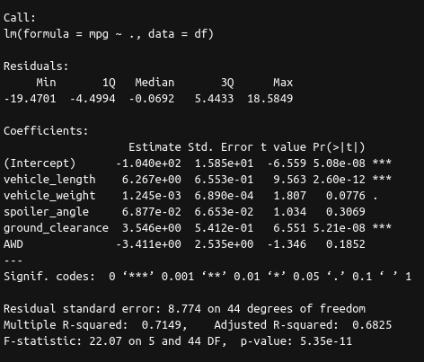
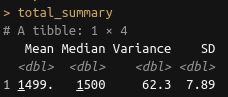
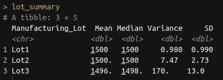
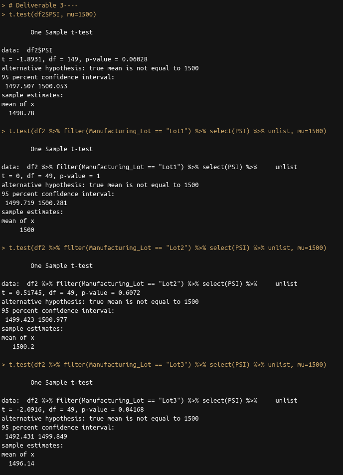

# Module 15

## Linear Regression to Predict MPG

The significant variables in this analysis are vehicle_length and ground_clearance.
The slope of the model is NOT considered to be zero, because the p-value of the F-statistic is very small. This means the model is better than the null model (slope of zero).
This model is somewhat effective at predicting mpg of MechaCar prototypes. It's R^2 is 68.25%, meaning the linear model explains 68.25% of the variance in the mpg. I'd prefer something a bit higher, but this is much better than random guessing.

## Summary Statistics on Suspension Coils

As shown in the screenshots above, the variance requirement of 100 is met in total, but not for Lot3 individually.

## T-Tests on Suspension Coils

Using a confidence level of 5%:
1. In total, the mean is not statistically different from 1500 (p-value of 0.06028)
2. For lot 1, the mean is not statistically different from 1500 (p-value of 1)
3. For lot 2, the mean is not statistically different from 1500 (p-value of 0.6072)
4. For lot 3, the mean is statistically different from 1500 (p-value of 0.04168)

Of these, only lot 3 has a mean statistically different from 1500

## Study Design: MechaCar vs Competition
This study would compare MechaCar's mpg against that of the competition, controlling for statistically significant variables (vehicle_length and ground_clearance).
I will perform this study by building a linear model for MechaCar, as well as the competition. I will ensure both models satisfy typical diagnostics and then compare the results, namely what are the coefficients for vehicle_length and ground_clearance? If MechaCar has higher coefficients, then it is better than its competition.
The null hypothesis is that MechaCar's coefficients will be the same as the competition, the alternative is that MechaCar's coefficients are not the same as the competition (two-tailed test)
I would use a Z-test to perform this test. See the following link: https://stats.stackexchange.com/questions/93540/testing-equality-of-coefficients-from-two-different-regressions
The only data I would need is a comparable one to the existing MechaCar_mpg.csv, but one that is representative of MechaCar's competition.
